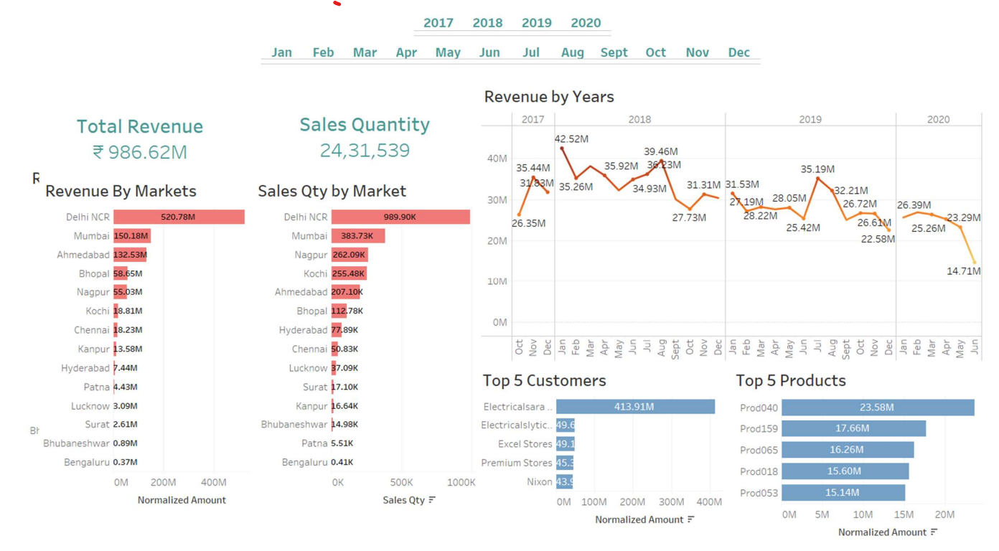

## Sales Insights Data Analysis Project

## Overview
Welcome to the Sales Insight project! This repository contains Tableau dashboards that provide insights into the revenue and profit analysis of a company. The primary aim of this project is to visualize key sales metrics and trends to help stakeholders make informed decisions.

## Project Structure
- **Revenue Analysis Dashboard**: This dashboard provides a comprehensive view of the company's revenue streams, including breakdowns by region, product, and time period.
- **Profit Analysis Dashboard**: This dashboard focuses on the profitability of the company, highlighting profit margins, cost analysis, and profit trends over time.

## Dashboards
### 1. Revenue Analysis Dashboard


#### Key Features:
- **Revenue Breakdown**: View revenue by region, product, and sales channel.
- **Time Series Analysis**: Analyze revenue trends over different time periods (monthly, quarterly, yearly).
- **Top Performers**: Identify top-performing products and regions.

### 2. Profit Analysis Dashboard


#### Key Features:
- **Profit Margins**: Understand profit margins across different segments.
- **Cost Analysis**: Breakdown of costs associated with products and regions.
- **Profit Trends**: Visualize profit trends and identify areas for improvement.

## Installation
To view and interact with the dashboards, you will need Tableau installed on your machine. If you don't have Tableau, you can download a free trial from [Tableau's official website](https://www.tableau.com/products/desktop).

## Usage
1. Clone the repository:
   ```bash
   git clone https://github.com/YashNawale26/Sales-Insights-Project-using-Tableau.git
   
2. Open Tableau and load the .twb files located in the dashboards directory.
3. Explore the dashboards to gain insights into the company's sales and profitability.

### Instructions to setup mysql on your local computer

1. Follow step in this video to install mysql on your local computer
https://www.youtube.com/watch?v=WuBcTJnIuzo

1. SQL database dump is in db_dump.sql file above. Download `db_dump.sql` file to your local computer and import it.

### Data Analysis Using SQL

1. Show all customer records

    `SELECT * FROM customers;`

1. Show total number of customers

    `SELECT count(*) FROM customers;`

1. Show transactions for Chennai market (market code for chennai is Mark001

    `SELECT * FROM transactions where market_code='Mark001';`

1. Show distrinct product codes that were sold in chennai

    `SELECT distinct product_code FROM transactions where market_code='Mark001';`

1. Show transactions where currency is US dollars

    `SELECT * from transactions where currency="USD"`

1. Show transactions in 2020 join by date table

    `SELECT transactions.*, date.* FROM transactions INNER JOIN date ON transactions.order_date=date.date where date.year=2020;`

1. Show total revenue in year 2020,

    `SELECT SUM(transactions.sales_amount) FROM transactions INNER JOIN date ON transactions.order_date=date.date where date.year=2020 and transactions.currency="INR\r" or transactions.currency="USD\r";`
	
1. Show total revenue in year 2020, January Month,

    `SELECT SUM(transactions.sales_amount) FROM transactions INNER JOIN date ON transactions.order_date=date.date where date.year=2020 and and date.month_name="January" and (transactions.currency="INR\r" or transactions.currency="USD\r");`

1. Show total revenue in year 2020 in Chennai

    `SELECT SUM(transactions.sales_amount) FROM transactions INNER JOIN date ON transactions.order_date=date.date where date.year=2020
and transactions.market_code="Mark001";`


